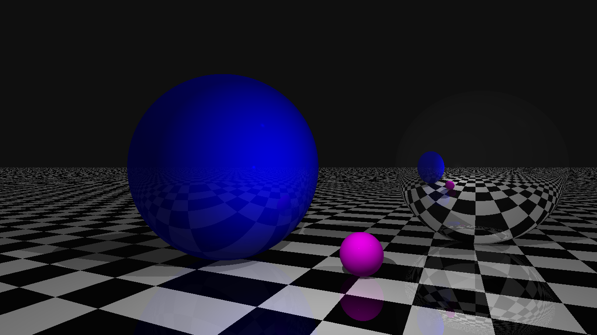

# Raytracing with HTML5

Followed the tutorial of Gabriel Gambetta's Book [which can be found here](https://www.gabrielgambetta.com/computer-graphics-from-scratch/)

https://user-images.githubusercontent.com/12075584/122659646-770f1c80-d150-11eb-955a-da3004e39b3a.mp4

(This is prerendered.)

Decided to not split in modules to not force anyone to serve locally, just hit index.html and enjoy the show.

Constants can be manipulated to achieve different resolutions and camera positions, but messing with the code is the most recommended.

Some functions can be uncommented to animate and automatically screencap every frame to make a prerendered animation. The video above was made that way.

